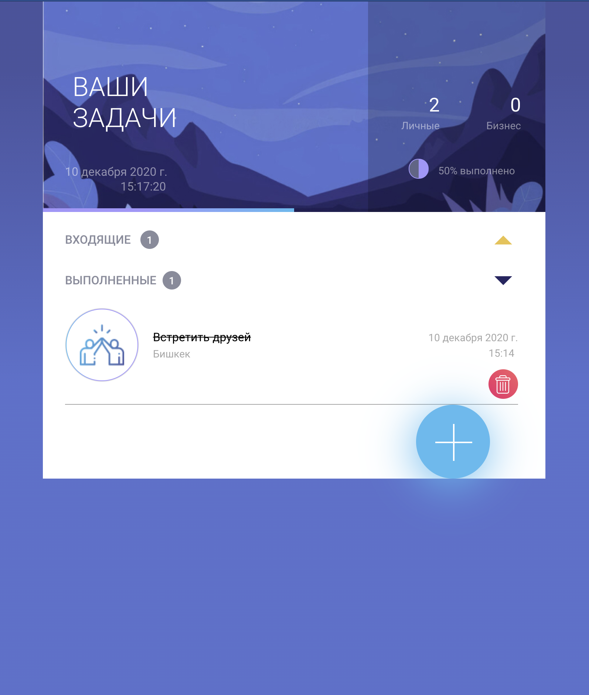

# Simple ToDo List ✨

## Table of Contents
- [Description](#description)
- [Preview](#preview)
- [How To Use](#how-to-use)
- [Author info](#author-info)

## Description

I decided to develop this project to practice my skills one more time. Practice makes
perfect as they say.

### What do I like about this project? 🔥
* It has a good-looking design
* I had an opportunity to design it in Figma (here comes the link https://www.figma.com/file/ln761zF8iavqNvK7oWZSay/To-Do-List?node-id=3%3A4)
* I added some cool features which I've never done before. They are dynamic gradient progress
  bar, gradient borders, and lots of great animations
* I used Redux for this app and learned its basics
* My ToDo List uses the localStorage to store user's data so there is no need for a server and database
* I experimented with a select element and added a custom arrow for it so it matches an app's design
* App counts the statistics

### What I don't like about this project?🌧
* The design of the app is not adaptive
* The categories for ToDo are static and changes in the code
* The localStorage has a limited size and can be exceeded
* It was my first time using Redux and I think I could make some mistakes

## Preview
|                      |                       |
| :-----------------------------------: | :-----------------------------------: |
|  | |
|  | |
|  | 

## How To Use
Node.js must be installed on your PC.
Then clone this project and run the command 'npm install' in its directory, because you need node modules.
Run 'npm start' also in the project directory.
You are good to go

## Author info

Write to me at alexander.06.zharkov@gmail.com if you have any thoughts about this project or something like an internship/job offer
